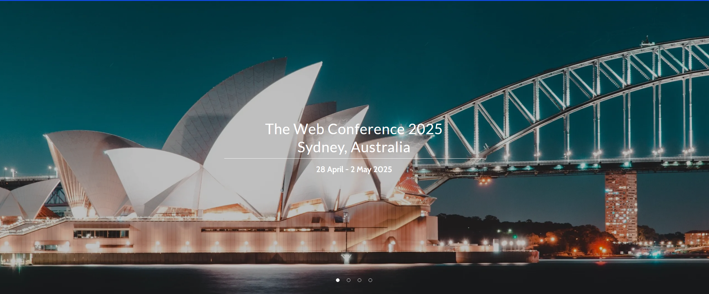

<link rel="stylesheet" href="style.css">

The Workshop on Non-Euclidean Foundation Models and Geometric Learning (NEGL) will take place at <a href="https://www2025.thewebconf.org/"> WebConf 2025</a> in Sydney, Australia, from April 28–May 2, 2025.
We invite you to join discussions on Non-Euclidean representation learning and geometric deep learning, and large foundation models, alongside web-related applications!

<!-- 

 -->

    

  

    Non-Euclidean Foundation Models and Geometric Learning (NEGL): Advancing AI Beyond Euclidean Frameworks @WebConf 2025
  

The primary objective of the NEGL workshop at [WebConf 2025](https://www2025.thewebconf.org/) is to create a collaborative platform for researchers, industry professionals, and academics from diverse fields. These include non-Euclidean representation learning, geometric deep learning, and large foundation models, as well as web-related applications such as recommender systems, social network analysis, web knowledge graphs, search systems, information retrieval, and multi-modal web content understanding. The workshop aims to foster knowledge sharing, idea exchange, and discussions on the latest advancements and challenges in these domains.

## Important Dates

* **2024-12-18**: Paper submission deadline  
* **2025-01-13**: Author notification  
* **2025-02-02**: Camera-ready submission  
* **2025-04-28**: Workshop at WebConf 2025 (Whole-day session)

TIMEZONE: Anywhere On Earth (UTC-12)

## Program Highlights

* **Interactive Poster Sessions**: Two dynamic sessions to present and discuss the latest research in non-Euclidean representation learning and foundation models, with a focus on web applications
* **Contributed Talks**: Selected high-quality papers presented in two dedicated slots, with approximately 4 papers chosen for oral presentations
* **Panel Discussion**: "FM & Non-Euclidean Space" exploring future directions and challenges in combining foundation models (e.g., LLMs) with non-Euclidean approaches
* **Networking Opportunities**:
  - Research matchmaking during coffee breaks
  - Informal discussions during lunch
  - Breakout discussion sessions
  - Opening ice-breaking activities
* **Awards**:
  - Best Paper Award for exceptional contributions
  - Best Poster Presentation Award for effective presentation and engagement
  - Travel awards to support students and authors needing financial assistance

## Call for Papers

We welcome submissions on the following topics (but not limited to):

- **Theoretical Foundations**: Explore the principles underlying non-Euclidean and geometric representation learning, focusing on properties such as curvature, geodesics, and isometries, and their influence on foundation model performance.

- **Architectures, Algorithms, and Large Foundation Models**: Develop novel architectures and algorithms integrating large foundation models (e.g., LLMs, ViTs, and multi-modal models) with non-Euclidean spaces and geometric principles, enhancing their capability to handle complex structures and relationships.

- **Adapting and Enhancing Existing Foundation Models**: Investigate approaches for fine-tuning, continual learning, and adapting existing foundation models to new tasks and domains. This includes integrating advanced techniques such as **GraphRAG** (Graph Retrieval-Augmented Generation) for knowledge-driven applications, and enabling agent-like capabilities for interactive and adaptive problem-solving in non-Euclidean.

- **Geometric Deep Learning**: Advance methods in geometric learning, including **graph neural networks**, **equivariant models, and message-passing framework**s, with applications to web-specific tasks like structured data representation and multi-modal alignment.

- **Web Applications and Case Studies**: Highlight applications in web domains, including **social networks, knowledge graphs, search systems, recommender systems, and multi-modal content understanding**.

- **Trustworthiness and Robustness**: Tackle challenges of fairness, interpretability, adversarial robustness, and privacy in non-Euclidean and geometric models, especially for user-facing web applications.

- **Benchmarks and Evaluation**: Propose new datasets, benchmarks, and evaluation protocols, emphasizing scalability and real-world performance on non-Euclidean and geometric models.

For submission guidelines, visit the [Call for Papers page]({{ "/cfp/" | relative_url }}).

## Organizers

The workshop is organized by an international and diverse team of experts in the field:

<table>
  <tr>
    <td> 
       
      <a href="https://yangmenglin.site/">Menglin Yang</a> 
      Yale University/HKUSTGZ
    </td>
    <td> 
       
      <a href="http://yifeiacc.github.io/">Yifei Zhang</a> 
      NTU
    </td>
    <td> 
       
      <a href="https://cather-chen.github.io/">Jialin Chen</a> 
      Yale University
    </td>
    <td> 
       
      <a href="http://melanie-weber.com/">Melanie Weber</a> 
      Harvard University
    </td>
    <td> 
       
      <a href="https://www.cs.yale.edu/homes/ying-rex/">Rex Ying</a> 
      Yale University
    </td>
  </tr> 
</table>

## Speakers

The workshop is organized by an international and diverse team of experts in the field:

<table>
  <tr>
    <td> 
       
      <a href="https://cs.uic.edu/profiles/philip-yu/">Philip S. Yu</a> 
      UIC
    </td>
    <td> 
       
      <a href="https://scholar.google.com.au/citations?user=frWRJN4AAAAJ&hl=en">Shirui Pan</a> 
      Griffith University
    </td>
    <td> 
       
      <a href="https://scholar.google.com/citations?user=P8WYyYIAAAAJ&hl=en">Min Zhou</a> 
      Huawei Technologies
    </td>
    <td> 
       
      <a href="https://staff.fnwi.uva.nl/p.s.m.mettes/">Pascal Mettes</a> 
      UvA
    </td>
  </tr> 
</table>

---

For questions or concerns, feel free to contact us at `mlyang[dot]yale[at]outlook.com`

We look forward to your participation in the workshop!
